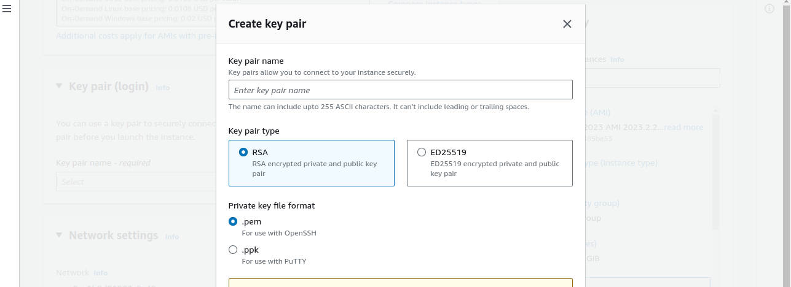

# Lamp Stack Implementation
When developing an application that runs on the web, we need a stack of tools, called a web stack. There are different types of stack. We have the MERN (Mongo, Express, React and Nodejs), MEAN (Mongo, Express, Angular and Nodejs).

Lamp stack is Linux, Apache, MySQL and PHP. Linux for the server OS, Apache web server to serve files on request, MySQL saves the application data, and PHP handles the logic of how website files are served by Apache.

We are going to be setting up the Lamp stack and testing our implementation.

## Step 1 - Create a virtual linux server in AWS.
Create a [free tier AWS account](https://aws.amazon.com/free/?trk=99f831a2-d162-429a-9a77-a89f6b3bd6cd&sc_channel=ps&ef_id=CjwKCAjwv-2pBhB-EiwAtsQZFFDyUaLYELIuU-xGf7UeXObz2idlfyRhp6TEqgpIHVs5_qXfnsndJxoCmbcQAvD_BwE:G:s&s_kwcid=AL!4422!3!645125273273!e!!g!!aws%20free%20trial!19574556890!145779847192&all-free-tier.sort-by=item.additionalFields.SortRank&all-free-tier.sort-order=asc&awsf.Free%20Tier%20Types=*all&awsf.Free%20Tier%20Categories=*all) and sign-in. Go to services > Compute and select EC2. Under 'Resources' go to Instances.

Click on the orange button on the top left that says "Launch Instance".

Enter your instance name, select Ubuntu as your "Application and OS images". Leave the Amazon Machine Image (AMI) and Instance type on default. Next is Keypair creation and download. Take note of this  step as you will need it to access the instance from your terminal. Click on the create keypair besides the input field.
This opens up a selection field. Enter a name for your keypair, and leave everything on default, click create keypair when you are done.

The keypair gets downloaded to your local computer files system.

For the purpose of this project, we will leave every other settings on default and click Launch Instance at the bottom right. You should see this display below with the "Instance State" green and running.

## Connect to the EC2 Instance from your local machine.
I will presume the .pem file (Keypair) we created and downloaded from the previous step was saved in the Downloads folder of your computer.
Now `cd Downloads` from your root directory. Change the file permission for your keypair. `chmod 400 <private-keypair>`

Run the command to connect to your remote EC2 server.

`ssh -i "keypair.pem" ubuntu@publicDNS.compute.amazonaws.com`

Remember to replace "Keypair.pem" above with the actual name you gave the keypair you created before you downloaded. Also replace "@publicDNS" above with the public DNS you get from your AWS console. If you are not sure where to find the public DNS, go to your EC2 dashboard, you should see Instance ID number written in blue, click on it, find Public iPv4 DNS, copy and paste on the connection command above.

## Step 2 - Install Apache and Update Firewall.
### Apache - 
Apache HTTP web server helps your server distribute webpages as users request them. It is a software that gets installed into your virtual or physical server to direct HTTP traffic from the internet.

Install Apache using Ubuntu package manager 'apt'.

Run the below command:

`#update a list of packages in package manager
$ sudo apt update`

`#run apache2 package installation
$ sudo apt install apache2
`

Check to see if your apache2 was properly installed with this command

`sudo systemctl status apache2`

Now we need to enable our virtual server to access web traffic. To do that, we add a new inbound rule in our EC2 instance.