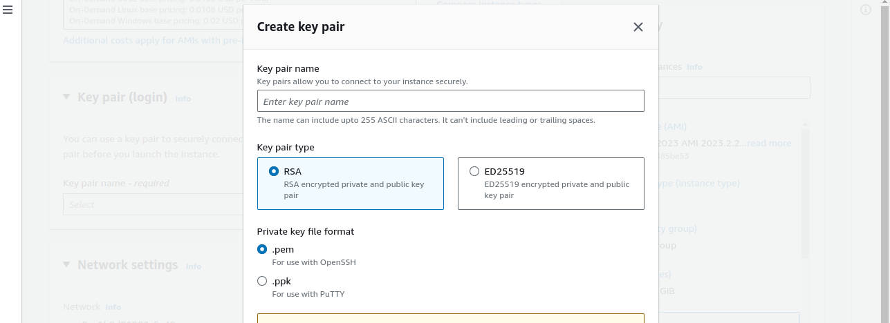

# Lemp Stack Implementation
When developing an application that runs on the web, we need a stack of tools, called a web stack. There are different types of stack. We have the MERN (Mongo, Express, React and Nodejs), MEAN (Mongo, Express, Angular and Nodejs).

Lemp stack is Linux, Nginx, MySQL and PHP. Linux for the server OS, Apache web server to serve files on request, MySQL saves the application data, and PHP handles the logic of how website files are served by Nginx.

We are going to be setting up the Lemp stack and testing our implementation.

## Step 1 - Create a virtual linux server in AWS.
Create a [free tier AWS account](https://aws.amazon.com/free/?trk=99f831a2-d162-429a-9a77-a89f6b3bd6cd&sc_channel=ps&ef_id=CjwKCAjwv-2pBhB-EiwAtsQZFFDyUaLYELIuU-xGf7UeXObz2idlfyRhp6TEqgpIHVs5_qXfnsndJxoCmbcQAvD_BwE:G:s&s_kwcid=AL!4422!3!645125273273!e!!g!!aws%20free%20trial!19574556890!145779847192&all-free-tier.sort-by=item.additionalFields.SortRank&all-free-tier.sort-order=asc&awsf.Free%20Tier%20Types=*all&awsf.Free%20Tier%20Categories=*all) and sign-in. Go to services > Compute and select EC2. Under 'Resources' go to Instances.

Click on the orange button on the top left that says "Launch Instance".

Enter your instance name, select Ubuntu as your "Application and OS images". Leave the Amazon Machine Image (AMI) and Instance type on default. Next is Keypair creation and download. Take note of this  step as you will need it to access the instance from your terminal. Click on the create keypair besides the input field.
This opens up a selection field. Enter a name for your keypair, and leave everything on default, click create keypair when you are done.

The keypair gets downloaded to your local computer files system.

For the purpose of this project, we will leave every other settings on default and click Launch Instance at the bottom right. You should see this display below with the "Instance State" green and running.

## Connect to the EC2 Instance from your local machine.
I will presume the .pem file (Keypair) we created and downloaded from the previous step was saved in the Downloads folder of your computer.
Now `cd Downloads` from your root directory. Change the file permission for your keypair. `chmod 400 <private-keypair>`

Run the command to connect to your remote EC2 server.

`ssh -i "keypair.pem" ubuntu@publicDNS.compute.amazonaws.com`

Remember to replace "Keypair.pem" above with the actual name you gave the keypair you created before you downloaded. Also replace "@publicDNS" above with the public DNS you get from your AWS console. If you are not sure where to find the public DNS, go to your EC2 dashboard, you should see Instance ID number written in blue, click on it, find Public iPv4 DNS, copy and paste on the connection command above.

## Step 2 - Install Nginx and Update Firewall.
### Nginx - 
Nginx HTTP web server helps your server distribute webpages as users request them. It is a software that gets installed into your virtual or physical server to direct HTTP traffic from the internet.

Install Nginx using Ubuntu package manager 'apt'.

Run the below command:

`#update a list of packages in package manager
$ sudo apt update`

`#run nginx package installation
$ sudo apt install nginx
`

Check to see if your apache2 was properly installed with this command

`sudo systemctl status apache2`

Now we need to enable our virtual server to access web traffic. To do that, we add a new inbound rule in our EC2 instance. Go to your instance, click on the instance ID, go down to security, click on security group, edit in inbound rule. Add a new inbound rule, type should be HTTP and port 80.

Now check if you can reach apache on the server from your terminal, to do that, run the curl command

`$ curl http://localhost:80
or
$ curl http://127.0.0.1:80
`

You should get the screen below.

Now lets see if we can access the same web server from our browser. Enter the public IP address from your EC2 console. You should see the screen below.

# Step 3 - Install MySQL Server
Now we need a database management system (DBMS) to store and manage our data.

Run the following command to `$ sudo apt install mysql-server`

Confirm installation with this command `$ sudo mysql`

This will connnect you to the MySQL database server as the administartive root user.
Set a password for the root user with the following command 

`ALTER USER 'root'@'localhost' IDENTIFIED WITH mysql_native_password BY 'PassWord.1';`

Exit the MySQL shell with the exit command.

Start the interactive script by running
`$ sudo mysql_secure_installation`.

This will ask you if you want tp validate password plugin. This means you have to set a password different from the root password. Click yes and choose your password.

Test the new password with this command 

`$ sudo mysql -p`

Exit the MySQL console.

# Step 4 - Install PHP
PHP is a programming language that lets us control the logic of how web pages are served.

To install PHP and its dependencies, run the following command:

`$ sudo apt install php libapache2-mod-php php-mysql`

Confirm installation

`php -v`

.

At this point your lemp stack setup is completed

- Linux
- Nginx
- MySQL
- PHP

You can go further and confirm the entire stack by deploying a PHP code.

## Testing PHP with Nginx
We are going to create a PHP file and execute that file on the browser. Create an index.php file at the root of your machine. Since we are using an Ubuntu machine, root path is `/var/wwww/html`. We are going to create an index.php file in the above directory and add a simple php code.

`$ echo "<?php phpinfo(); ?>" >> /var/www/html/index.php`

This will create an index.php file inside the above folder and a script that displays php info on the browser.

Change the permissions of the directory so it can be accessed by Nginx.

`sudo chmod -R 777 /var/www/html/index.php`

Edit the Nginx config file by running 

`sudo nano /etc/nginx/sites-available/default`

add your public server IP and add index.php to route path. The completed file should look like the image below.

Go to your browser and enter your-ip-address/index.php. The PHP info should show up like the image below.

## Step 5 - Retrieving Data from MySQL
In this step will create a test database (DB) with simple "To do list" and configure access to it, so the Nginx websire would be able to query data from the DB and display it.

Let us create an task_database and a user named task_user.
First connect to the MySQL console using the password we created before:

`sudo mysql -p`

To create a database, run the following command

`CREATE DATABASE `task_database``

Create a new user and grant full access to the database

`mysql>  CREATE USER 'task_user'@'%' IDENTIFIED WITH mysql_native_password BY 'PassWord.1';
`

Give this user permission over the task_database.

`mysql> GRANT ALL ON task_database.* TO 'task_user'@'%';
`
