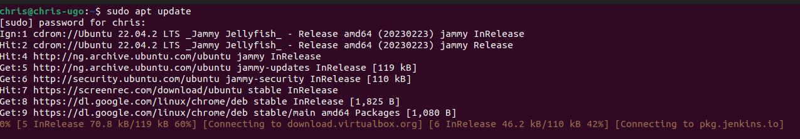
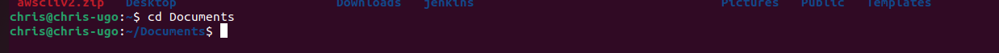

# Linux Project Documentation.
This folder containes a list of linux terminal commands and their explanations. 
## sudo command
sudo stands for super user do. This command grants the user admin rights after password verification.

Type  `sudo apt-get` in the terminal to use the command.

## pwd command
Present working directory is a command used for printing out the present directory.
S

## ls command
This is used to list all the files and folders in the current directory. There are a few options that can be past along with this command. ls -a list all files, ls -lh list all files with their permissions and ownership

## cd command
cd stands for change directory. The command allows you to navigate between folders and directories.

## cat command
This command prints out the content of a file on the terminal.

## cp command
cp command copies a file or the content of the file to another destination. You can use just cp or specify a path.

## mv command
This command is used to move files from one folder/directory to another. Unlike the cp command, mv removes the file from it's initial directory.

## mkdir command
This creates a new folder in the current directory.

## rmdir command
This removes or deletes the folder passed as an option.

## rm file command
This removes or deletes a file from the current directory.

## touch command
This command creates a file in the current working directory.

## locate command
This command will find a file in the database. Also, passing the optional argument -i will remove case sensitivity in the search and return all matching results.

## find command 
Use this command to find a file in a specif directory.

## grep command
grep means global regular expression find. It finds a word by searching through all the text in a file.

## df command
Use this command to report the disc space usage, shown in percentage and kilobyte.

## du command
Use this command to check how much space a file or directory uses.

## head command
This command prints out the first ten lines in a file.

## tail command
This command prints the last ten lines in a given file.

## chmod command
This command is use to change the access permission of a file or directory. For example, to grant, read, write and execute access to a file use the `chmod 777 <file name>`

## chown command
Use this command to change the ownership of a file to another user.

## kill
This terminates a particular running process using the process ID.

